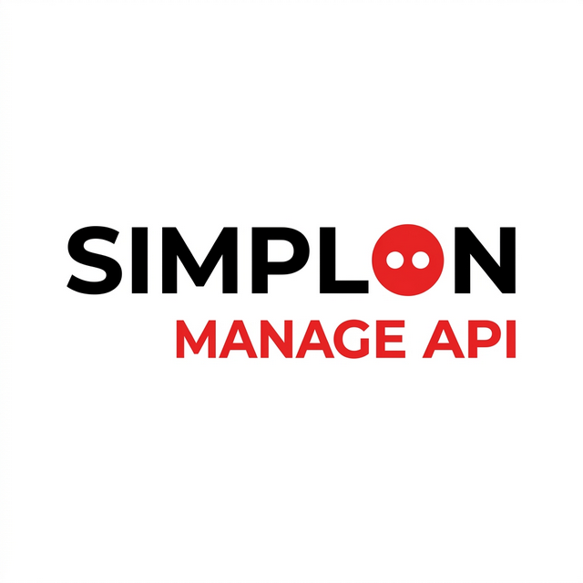

# Simplon Manage API



## Description
API RESTful pour la gestion centralisée d'un centre de formation Simplon. Cette solution permet d'automatiser le suivi des formations, l'organisation des sessions, la gestion des utilisateurs et le contrôle des inscriptions.

## Architecture Logicielle
Le projet respecte une architecture en couches (Clean Architecture) pour assurer la maintenabilité et la testabilité du code :

- Couche Routes : Gère les points d'entrée de l'API et la communication HTTP via FastAPI.
- Couche Schémas : Assure la validation, le typage des données et la structure des échanges via Pydantic.
- Couche Services : Centralise la logique métier, les calculs et les règles décisionnelles de l'application.
- Couche Modèles : Définit la structure des tables en base de données avec SQLAlchemy.

## Technologies Utilisées
- Langage : Python 3.12+
- Framework : FastAPI
- Base de données : SQLite
- ORM : SQLAlchemy
- Migrations : Alembic
- Validation : Pydantic v2
- Tests : Pytest

## Arborescence du Projet
```text
.
├── alembic/              # Gestion des migrations de base de données
├── app/                  # Code source principal de l'application
│   ├── core/             # Configuration globale et exceptions centralisées
│   ├── db/               # Configuration de la session et de l'engine de base de données
│   ├── models/           # Modèles de données (entités SQLAlchemy)
│   ├── routes/           # Définition des endpoints et des routers FastAPI
│   ├── schemas/          # Modèles de validation et DTOs (Pydantic)
│   └── services/         # Implémentation de la logique métier (Services)
├── assets/               # Ressources statiques et médias (bannières, logos)
├── tests/                # Suite complète de tests unitaires et d'intégrité
├── alembic.ini           # Fichier de configuration pour les migrations
├── app.db                # Fichier de base de données SQLite local
├── requirements.txt      # Liste des dépendances du projet
└── README.md             # Documentation principale du projet
```

## Installation et Configuration
1. Cloner le projet depuis le dépôt distant.
2. Créer un environnement virtuel :
   ```bash
   python -m venv venv
   ```
3. Activer l'environnement virtuel :
   - Linux/macOS : `source venv/bin/activate`
   - Windows : `.\venv\Scripts\activate`
4. Installer les dépendances :
   ```bash
   pip install -r requirements.txt
   ```
5. Appliquer les migrations pour initialiser la base de données :
   ```bash
   alembic upgrade head
   ```

## Utilisation
Pour lancer le serveur de développement avec rechargement automatique :
```bash
uvicorn app.main:app --reload
```
L'API est alors accessible sur `http://127.0.0.1:8000`.
La documentation interactive (Swagger UI) est disponible sur `http://127.0.0.1:8000/docs`.

## Tests et Qualité
Le projet intègre une suite de tests automatisés couvrant les aspects unitaires et d'intégrité. Pour exécuter les tests et générer un rapport de couverture :
```bash
python -m pytest tests/ -v --cov=app --cov-report=term-missing
```
La couverture de code actuelle est supérieure à 94%.
